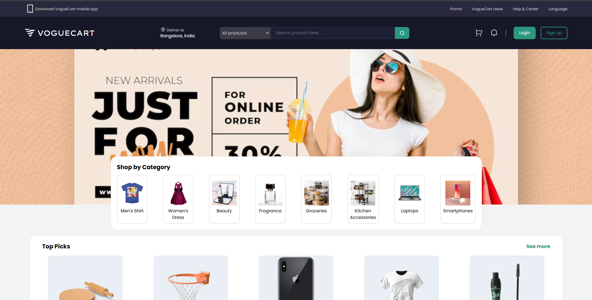
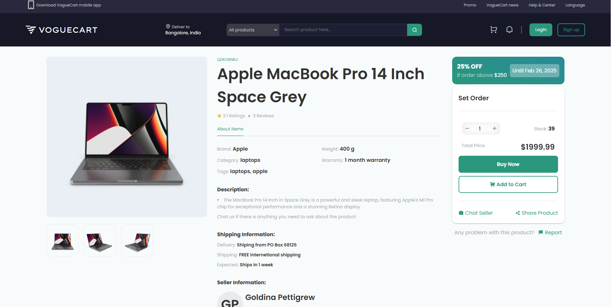

# VOGUEMART

## Introduction

VogueCart is a comprehensive online marketplace designed to enhance the shopping experience by offering a vast range of products across multiple categories. The platform enables users to browse, search, and purchase products with ease while ensuring a user-friendly and intuitive interface. With a modern and responsive design, VogueCart delivers seamless functionality, making online shopping convenient and efficient. The integration of advanced technologies enhances performance, security, and scalability, ensuring a reliable and robust e-commerce experience.

## Project Type

Frontend

## Deployed App

Frontend: https://narsijangid.github.io/B42_WEB_003_Web-Wizards/
Backend: N/A
Database: https://b42web03webwizards-default-rtdb.asia-southeast1.firebasedatabase.app/

## Directory Structure

```bash
└── narsijangid-b42_web_003_web-wizards/
    ├── README.md
    ├── index.html
    ├── style.css
    ├── admin/
    │   ├── auth/
    │   │   ├── AdminRegister.html
    │   │   ├── Adminlogin.css
    │   │   ├── Adminlogin.html
    │   │   └── js/
    │   │       ├── AdminRegister.js
    │   │       └── Adminlogin.js
    │   ├── css/
    │   │   └── admin.navbar.module.css
    │   ├── dashboard/
    │   │   ├── dashboard.html
    │   │   ├── css/
    │   │   │   └── style.module.css
    │   │   └── js/
    │   │       └── dashboard.js
    │   ├── js/
    │   │   └── admin.navbar.js
    │   ├── orders/
    │   │   ├── Orderlist.js
    │   │   ├── Orderslist.html
    │   │   ├── orderdetail.html
    │   │   ├── orders.html
    │   │   └── css/
    │   │       ├── Orderlist.css
    │   │       └── OrdersManage.css
    │   ├── products/
    │   │   ├── product-form1.css
    │   │   ├── product-form2.js
    │   │   ├── product_table.css
    │   │   ├── product_table.html
    │   │   └── products_form.html
    │   └── profile/
    │       ├── profile.css
    │       ├── profile.html
    │       └── profile.js
    ├── css/
    │   ├── font.module.css
    │   ├── footer.module.css
    │   └── navbar.module.css
    ├── images/
    ├── js/
    │   ├── index.js
    │   └── navbar.js
    └── users/
        ├── auth/
        │   ├── UserRegister.html
        │   ├── userlogin.html
        │   ├── css/
        │   │   ├── UserRegister.css
        │   │   └── Userlogin.css
        │   └── js/
        │       ├── UserRegister.js
        │       └── userlogin.js
        ├── cartAndpayment/
        │   ├── cartAndPayment.html
        │   ├── css/
        │   │   └── cartAndPayment.css
        │   └── js/
        │       └── cartAndPayment.js
        ├── orders/
        │   ├── orders.html
        │   ├── css/
        │   │   └── orders.css
        │   └── js/
        │       └── orders.js
        └── products/
            ├── individualProduct.html
            ├── products.html
            ├── css/
            │   ├── individualProduct.css
            │   └── products.css
            └── js/
                ├── individualProduct.js
                └── products.js
```

## Video Walkthrough of the project

A very short video walkthrough of all of the features [ 1 - 3 minutes ]
https://drive.google.com/file/d/180OevqswBEzBdE89SH1o7YH2TnAFyc8C/view?usp=drive_link

## Video Walkthrough of the codebase

A very short video walkthrough of the codebase [ 1 - 5 minutes ]
https://drive.google.com/file/d/1FndWl3efYQ-YiMcfMxkW4kP9kU0WTKO2/view?usp=drive_link

## Features

List out the key features of your application.

- User Authentication & Authorization: Secure login and registration for users, with encrypted password storage and session management.
- Product Management: A vast collection of products categorized efficiently for easy browsing and quick searching.
- Advanced Search & Filtering: Allows users to find specific products using keywords, categories, and filters such as price, brand, and ratings.
- Secure Payment Integration: Supports multiple payment gateways, ensuring safe and hassle-free transactions.
- Responsive UI: Ensures a smooth experience across all devices, including mobile and desktop.
- Order Tracking: Users can monitor their order status, including processing, shipping, and delivery updates.
- User Reviews & Ratings: Customers can provide feedback and rate products, helping others make informed purchasing decisions.
- Wishlist & Cart Management: Users can save items for later or proceed with a seamless checkout experience.
- Admin Dashboard: A dedicated portal for administrators to manage products, orders, users, and reports efficiently.
- API Integration: Enhances the system with third-party APIs for additional functionalities such as product recommendations, analytics, and location-based services.
- Session Storage: Ensures user session persistence and enhances user experience with temporary data storage.

## Design Decisions or Assumptions

List your design decisions & assumptions

- Used HTML, CSS, and JavaScript for the frontend due to their simplicity and wide browser support.
- Chose Firebase for the database to leverage its real-time data capabilities.
- Implemented manual authentication using session storage and local storage for user sessions and data persistence.

## Installation & Getting Started

Detailed instructions on how to install, configure, and get the project running.

```bash
# Clone the repository
git clone https://github.com/narsijangid/B42_WEB_003_Web-Wizards.git
cd B42_WEB_003_Web-Wizards

# Open index.html in your browser
```

## Usage

Provide instructions and examples on how to use your project.

```bash
# Example: Creating a new content item
1. Navigate to the content management page.
2. Click on "Add New Item".
3. Fill in the required fields and submit.
```

## Screenshots

Landing page:


Auth page:


Product page:


## Credentials

Provide user credentials for authenticated pages

- Admin: admin@mail.com / password123
- User: user@mail.com / password123

## APIs Used

- Firebase Realtime Database for data storage

## API Endpoints

List of your API endpoints, methods, brief descriptions, and examples of request/response.

| Endpoint        | Method | Description           |
| :-------------- | :----- | :-------------------- |
| `/api/products` | `GET`  | Retrieve all products |
| `/api/orders`   | `GET`  | Retrieve all orders   |
| `/api/cart`     | `GET`  | Retrieve cart items   |
| `/api/users`    | `GET`  | Retrieve all users    |

## Technology Stack

List and provide a brief overview of the technologies used in the project.

- HTML: Markup language for creating web pages
- CSS: Stylesheet language for designing web pages
- JavaScript: Programming language for web development
- Firebase: Backend-as-a-Service for database
- Session Storage: For managing user sessions
- Local Storage: For persisting user data
